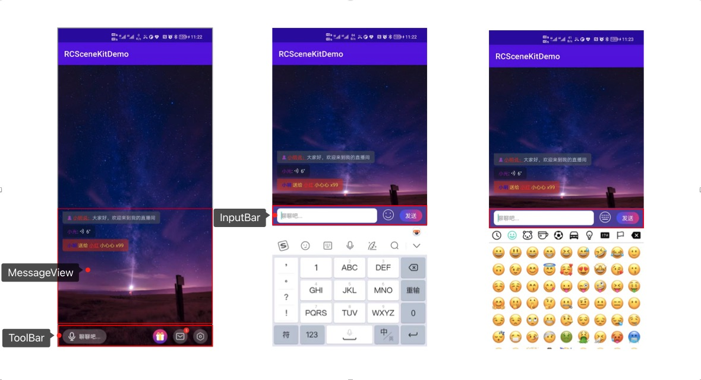

# ChatRoomKit 文档

## 将 `ChatRoomView` 放在项目的布局文件中，并在 Activity 中初始化

```
<?xml version="1.0" encoding="utf-8"?>
<LinearLayout xmlns:android="http://schemas.android.com/apk/res/android"
    xmlns:tools="http://schemas.android.com/tools"
    android:layout_width="match_parent"
    android:layout_height="match_parent"
    android:orientation="vertical"
    tools:context=".MainActivity">

    <View
        android:layout_width="match_parent"
        android:layout_height="0dp"
        android:layout_weight="1" />

    <!--这里自己定义 view 在页面中的位置-->
    <cn.rongcloud.chatroomkit.widget.ChatRoomView
        android:id="@+id/chat_room_view"
        android:layout_weight="1"
        android:layout_width="match_parent"
        android:layout_height="0dp" />

</LinearLayout>
```

```
// 初始化 ChatRoomView
ChatRoomView chatRoomView = findViewById(R.id.chat_room_view);
```

## `ChatRoomView` 使用

`ChatRoomView` 内部包含三个自定义 View，通过 ChatRoomView 提供的 api 可以操作其中的数据及 UI

- MessageView 展示消息列表
- ToolBar 底部功能栏
- InputBar 输入框



### MessageView 相关设置和监听

1. 构建富文本消息体，实现 `IRCChatroomMessage ` 接口，示例如下:

```java
public class RCChatroomMessage implements IRCChatroomMessage {
    /**
     * 消息发送者的 id
     */
    private String userId;

    /**
     * 消息发送者的名称
     */
    private String userName;

    /**
     * 消息内容
     */
    private String message;

    /**
     * 构造方法
     *
     * @param message 消息
     */
    public RCChatroomMessage(String userId, String userName, String message) {
        this.userId = userId;
        this.userName = userName;
        this.message = message;
    }

    /**
     * @return 返回气泡背景颜色，返回 null 采用默认配置
     */
    @Override
    public Argb bubbleColor() {
        return new Argb(0.5f, 100, 100, 100);
    }

    /**
     * @return 返回气泡文字颜色，返回 null 采用默认配置
     */
    @Override
    public Argb bubbleTextColor() {
        return new Argb(0.7f, 255, 255, 255);
    }

    /**
     * @return 返回气泡圆角，返回 null 采用默认配置
     */
    @Override
    public Corner bubbleCorner() {
        return new Corner(0, 15, 15, 15);
    }

    /**
     * 消息体富文本
     */
    private SpannableStringBuilder spannableStringBuilder;

    /**
     * 构建消息体富文本
     * {@link MessageItem} 是消息体富文本中的最小可配置单元，
     * 可单独配置某几个文字的点击事件和文字颜色，不设置采用 {@link #bubbleTextColor()} 的颜色
     * 可以创建一个 MessageItem 集合，
     * 调用 {@link MessageContentUtils#buildMessage(List, OnMessageContentClickListener)}方法构建消息体富文本
     * 可参考以下示例构建一条富文本，例如："😈小明说：大家好"，其中 "小明说：" 可点击，点击后返回 userId
     *
     * @param clickSpan 回传的点击事件监听
     * @return 返回消息体富文本
     */
    @Override
    public SpannableStringBuilder buildMessage(OnMessageContentClickListener clickSpan) {
        if (spannableStringBuilder == null) {
            // MessageItem 集合
            List<MessageItem> messageItemList = new ArrayList<>();
            // 可以添加带icon的富文本
            SpannableString iconString = new SpannableString("  ");
            Drawable drawable = ContextCompat.getDrawable(MyApplication.app, R.drawable.ic_creator);
            int iconSize = UiUtils.dp2px(MyApplication.app, 11);
            drawable.setBounds(0, 0, iconSize, iconSize);
            iconString.setSpan(new CenterAlignImageSpan(drawable), 0, 1, Spanned.SPAN_INCLUSIVE_EXCLUSIVE);
            messageItemList.add(new MessageItem<>(iconString));
            // 可点击的用户名
            messageItemList.add(new MessageItem(new SpannableString(userName + "说："), userId, true, Color.parseColor("#FF0000"), true));
            // 普通文本
            messageItemList.add(new MessageItem<>(new SpannableString(message)));
            // 使用 MessageContentUtils.buildMessage 构建
            spannableStringBuilder = MessageContentUtils.buildMessage(messageItemList, clickSpan);
        }
        return spannableStringBuilder;
    }
}
```

2. 构建语音消息，实现 `IRCChatroomVoiceMessage` 接口，示例如下：

```java
public class RCChatroomVoice implements IRCChatroomVoiceMessage {
    /**
     * 语音文件（或文件路径）
     */
    private File file;
    /**
     * 语音时长
     */
    private long duration;
    /**
     * 用户名
     */
    private String userName;

    /**
     * 用户 id
     */
    private String userId;

    public RCChatroomVoice(File file, long duration, String userName, String userId) {
        this.file = file;
        this.duration = duration;
        this.userName = userName;
        this.userId = userId;
    }

    @Override
    public Argb bubbleColor() {
        return null;
    }

    @Override
    public Argb bubbleTextColor() {
        return null;
    }

    @Override
    public Corner bubbleCorner() {
        return null;
    }

    private SpannableStringBuilder spannableStringBuilder;

    /**
     * 构建消息体，参考富文本消息
     * @param clickSpan
     * @return
     */
    @Override
    public SpannableStringBuilder buildMessage(OnMessageContentClickListener clickSpan) {
        if (spannableStringBuilder == null) {
            List<MessageItem> messageItemList = new ArrayList<>();
            messageItemList.add(new MessageItem<>(new SpannableString(userName), userId, true, Color.parseColor("#99FF00FF")));
            messageItemList.add(new MessageItem<>(new SpannableString(": ")));
            spannableStringBuilder = MessageContentUtils.buildMessage(messageItemList, clickSpan);
        }
        return spannableStringBuilder;
    }

    /**
     * 返回语音文件路径，本地或网络
     *
     * @return
     */
    @Override
    public String voicePath() {
        return file.getAbsolutePath();
    }

    /**
     * 返回语音时长
     *
     * @return
     */
    @Override
    public long voiceDuration() {
        return duration;
    }
}
```

3. 添加消息到列表

```
// 设置默认消息
chatRoomView.setMessages(messageList);
// 批量添加消息
chatRoomView.addMessages(messageList);
// 添加单个消息
chatRoomView.addMessage(message);
```

4. 设置消息体富文本点击事件

```
// 设置消息富文本点击
        chatRoomView.setOnMessageContentClickListener(new OnMessageContentClickListener() {
            @Override
            public void onClickMessageContent(Object clickParam) {
                Toast.makeText(getBaseContext(), clickParam.toString(), Toast.LENGTH_SHORT).show();
            }
        });
```

### ToolBar 相关设置和监听

1. 默认 ToolBar 底部的按钮从远端的配置拉取，如果想代码手动控制，则需要传入 ActionButton 集合即可，例如：

```
// 手动配置ToolBar底部按钮
List<ActionButton> actionButtonList = new ArrayList<>();

ActionButton actionButton0 = new ActionButton();
actionButton0.setLocalIcon(R.drawable.ic_send_gift);
actionButton0.setHasBadge(false);
actionButtonList.add(actionButton0);

ActionButton actionButton1 = new ActionButton();
actionButton1.setLocalIcon(R.drawable.ic_message);
actionButton1.setHasBadge(true);
actionButton1.setBadgeNum(5);
actionButtonList.add(actionButton1);

ActionButton actionButton2 = new ActionButton();
actionButton2.setLocalIcon(R.drawable.rckit_ic_setting);
actionButton2.setHasBadge(false);
actionButtonList.add(actionButton2);

chatRoomView.setToolbarActionButtons(actionButtonList);
```

2. 设置 ToolBar 底部按钮监听

```
// 设置ToolBar底部按钮监听
chatRoomView.setToolbarActionListener(new ToolBar.OnActionClickListener() {
    @Override
    public void onClickAction(int index, String extra) {
        Toast.makeText(getBaseContext(), "index: " + index + " ,extra: " + extra, Toast.LENGTH_SHORT).show();
    }
});
```

3. 设置 ToolBar 录音按钮监听

```
// 设置录音监听
chatRoomView.setOnAudioRecordListener(new AudioRecordManager.OnAudioRecordListener() {
    @Override
    public boolean onRecordStart() {
        // return true 拦截录制，false 不拦截，可以用来做是否可用录音的前置判断，如麦克风被占用，则点击后不触发录音
        return false;
    }

    @Override
    public void onRecordCanceled() {
        // 录音取消
    }

    @Override
    public void onFinished(File file, long duration) {
        // TODO 上传语音到服务器，uploading。。。。

        //  成功后发送消息到消息区
        RCChatroomVoice chatroomVoice = new RCChatroomVoice(file, duration, "小光", "123454");
        chatRoomView.addMessage(chatroomVoice);
    }
});
```

### InputBar 相关设置和监听

```
// 设置 InputBar 监听
chatRoomView.setInputBarListener(new InputBar.InputBarListener() {
    @Override
    public void onClickSend(String message) {
        if (TextUtils.isEmpty(message)) {
            return;
        }
        // 这里可以把发送的消息主动添加到消息列表
        chatRoomView.addMessage(new RCChatroomMessage(message));
    }

    @Override
    public boolean onClickEmoji() {
        // return true 拦截内部的emoji点击事件，可以自己实现弹出emoji选择器
        // return false 不拦截，默认采用内部的emoji选择器
        return false;
    }
});
```